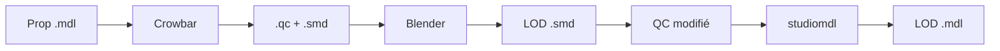

# Source Engine LOD Builder

<div align="center">


**Générateur automatique de LODs (Level of Detail) pour Garry's Mod et Source Engine**

[Fonctionnalités](#-fonctionnalités) • [Installation](#-installation) • [Utilisation](#-utilisation) • [Configuration](#%EF%B8%8F-configuration) 

</div>

---

## Description

**Source Engine LOD Builder** est un outil professionnel qui automatise la création de modèles LOD (Level of Detail) pour les props Garry's Mod et Source Engine. Il analyse vos maps VMF ou dossiers de modèles, décompile automatiquement les `.mdl`, génère des versions optimisées avec Blender, et les recompile pour améliorer les performances in-game.

### Pourquoi utiliser des LODs ?

- **Performance** : Réduction significative du lag dans les maps complexes
- **FPS** : Augmentation de 30-60% des FPS sur les grandes scènes
- **Distance** : Modèles simplifiés automatiquement chargés selon la distance de la caméra
- **Qualité** : Aucune perte visuelle notable à distance normale de jeu

---

## Fonctionnalités

### Analyse & Détection

- **Analyse VMF** : Scanne vos maps Hammer pour identifier tous les props utilisés
- **Analyse de dossiers** : Parcourt récursivement vos dossiers `models/` 
- **Extraction VPK** : Supporte l'extraction automatique depuis les archives VPK de Garry's Mod
- **Statistiques détaillées** : Compte d'utilisation, classname, taille de fichier

### Génération Automatique

- **Pipeline complet** : Décompilation -> Décimation -> Recompilation
- **Blender intégré** : Utilise l'algorithme de décimation Blender pour réduire les polygones
- **Niveaux multiples** : Génère jusqu'à 8 niveaux de LOD par prop
- **Physiques préservées** : Option pour conserver ou reconstruire les modèles de collision
- **Batch processing** : Traite plusieurs props en parallèle (multithread)

### Interface Intuitive

- **Drag & Drop** : Glissez-déposez vos fichiers VMF directement
- **Preview 3D** : Visualisation des modèles et LODs générés
  - Support Pyglet ou OpenGL/GLUT
  - Rotation libre, zoom, contrôles clavier
- **Filtrage avancé** :
  - Par statut (Ready/Processing/Done/Error)
  - Par type de prop (prop_static, prop_physics, etc.)
  - Par quantité d'utilisation (min/max)
  - **Par taille de fichier** (Ko/Mo)
  - Tri ascendant/descendant
- **Recherche** : Filtre par nom de modèle en temps réel
- **Multilingue** : Interface EN/FR

### Outils Intégrés

- **Gestion des paramètres** : Sauvegarde/Chargement de profils
- **Cache VPK** : Extraction une seule fois, réutilisation rapide
- **Logs détaillés** : Historique complet avec timestamps
- **Gestion d'erreurs** : Messages clairs en cas de problème
- **Stop en cours** : Annulation propre des jobs en cours

---

## Installation

### Prérequis

#### Obligatoire
- **Python 3.8+** : [Télécharger Python](https://www.python.org/downloads/)
- **Blender 2.8+** : [Télécharger Blender](https://www.blender.org/download/)
- **Crowbar** : [Télécharger Crowbar](https://github.com/ZeqMacaw/Crowbar/releases) (décompilateur Source)
- **studiomdl.exe** : Inclus avec Source SDK ou Garry's Mod

#### Optionnel (pour preview 3D)
```bash
pip install pyglet PyOpenGL
```

#### Optionnel (pour drag & drop)
```bash
pip install tkinterdnd2
```

#### Optionnel (pour preview images)
```bash
pip install Pillow
```

### Installation

1. **Clonez le repository**
   ```bash
   git clone https://github.com/VOTRE_USERNAME/source-lod-builder.git
   cd source-lod-builder
   ```

2. **Installez les dépendances Python**
   ```bash
   pip install -r requirements.txt
   ```

3. **Lancez l'application**
   ```bash
   python LOD_Generator.py
   ```

---

## Utilisation

### Démarrage Rapide

#### Option 1 : Analyser une Map VMF

1. Cliquez sur **"..."** à côté de "VMF"
2. Sélectionnez votre fichier `.vmf`
3. Cliquez sur **"Analyse VMF"**
4. Tous les props de la map sont détectés avec leur count d'utilisation

#### Option 2 : Analyser un Dossier

1. Cliquez sur **"..."** à côté de "Models folder"
2. Sélectionnez votre dossier `garrysmod/models/`
3. Cliquez sur **"Analyse Folder"**
4. Tous les fichiers `.mdl` sont listés

### Configuration des Chemins

Avant de générer des LODs, configurez les chemins obligatoires :

| Champ | Description | Exemple |
|-------|-------------|---------|
| **Source/GMod** | Racine de votre installation Garry's Mod | `C:/Program Files/Steam/steamapps/common/GarrysMod` |
| **Output** | Dossier de sortie pour les LODs générés | `C:/Users/YourName/Desktop/lod_output` |
| **studiomdl** | Chemin vers studiomdl.exe | `C:/Program Files/Steam/steamapps/common/GarrysMod/bin/studiomdl.exe` |
| **blender** | Chemin vers blender.exe | `C:/Program Files/Blender Foundation/Blender 3.6/blender.exe` |
| **Crowbar** | Chemin vers Crowbar.exe | `C:/Tools/Crowbar/Crowbar.exe` |

Utilisez **Save** pour sauvegarder votre configuration.

### Génération de LODs

#### Paramètres LOD

- **LOD Levels** : Nombre de niveaux de LOD à générer (1-8)
  - LOD1 : 75% des polygones
  - LOD2 : 50% des polygones
  - LOD3 : 25% des polygones
  - etc.

- **Switch Distance** : Distance (unités Source) entre chaque niveau
  - Défaut : 300 unités

- **Physics** :
  - **Rebuild** : Recompile les modèles de collision (peut causer des bugs)
  - **Keep** (recommandé) : Préserve les physiques originales

#### Génération

1. **Un prop** : Sélectionnez-le -> **"SELECTED"**
2. **Plusieurs props** : Multi-sélection (Ctrl+Click) -> **"SELECTED (n)"**
3. **Tous les props** : **"ALL PROPS"**

### Filtrage et Tri

#### Filtres disponibles

- **Search** : Recherche par nom de modèle
- **Status** : All / Ready / Processing / Done / Error
- **Type** : prop_static, prop_physics, prop_dynamic, etc.
- **Count** : min/max (nombre d'utilisations dans la map)
- **Size (Ko)** : min/max (taille du fichier .mdl)

#### Tri

- **Count** : None / Asc / Desc
- **Size (Ko)** : None / Asc / Desc

 **Astuce** : Triez par "Size Desc" pour traiter les gros modèles en priorité !

### Preview 3D

1. Sélectionnez un prop
2. Cliquez sur **"3D Preview"**
3. Contrôles :
   - **Souris** : Rotation (clic gauche + drag)
   - **Molette** : Zoom
   - **Flèches** : Rotation par touches
   - **Slider** : Naviguer entre LOD0, LOD1, LOD2, etc.

---

## Configuration

### Fichier de Configuration

Les paramètres sont sauvegardés dans `%LOCALAPPDATA%/Temp/LodTEMP/settings.json`

```json
{
  "vmf_path": "C:/maps/mymap.vmf",
  "models_dir": "C:/garrysmod/models",
  "game_root": "C:/Program Files/Steam/steamapps/common/GarrysMod",
  "output_root": "C:/output",
  "studiomdl_path": "C:/garrysmod/bin/studiomdl.exe",
  "blender_path": "C:/Program Files/Blender Foundation/Blender 3.6/blender.exe",
  "crowbar_path": "C:/Tools/Crowbar/Crowbar.exe",
  "lod_levels": 3,
  "lod_distance": 300,
  "physics_mode": "keep",
  "max_workers": 7,
  "lang": "en"
}
```

### Cache VPK

Le cache VPK est stocké dans `%LOCALAPPDATA%/Temp/LodTEMP/vpk_cache/`

- **Scan VPK** : Scanne une seule fois les archives VPK
- **Cache** : Ouvre le dossier de cache (pour nettoyer si besoin)

---

## Détails Techniques

### Architecture

```
LOD_Generator.py
├── VPK Extraction System    -> Gestion des archives Garry's Mod
├── VMF Parser               -> Analyse des maps Hammer
├── Model Extraction         -> Scan de dossiers .mdl
├── QC Parser                -> Lecture/modification des fichiers QC
├── Blender Integration      -> Décimation automatique via scripts Python
├── Crowbar Integration      -> Décompilation des .mdl
├── studiomdl Integration    -> Recompilation des .mdl
├── 3D Preview System        -> Rendu OpenGL/Pyglet
└── GUI (tkinter)            -> Interface utilisateur
```

### Pipeline de Génération



### Formats Supportés

- **Input** : `.mdl` (Source Engine Model)
- **Intermediate** : `.qc`, `.smd`, `.vta`, `.phy`
- **Output** : `.mdl` avec LODs intégrés

### Multithread

Le système utilise `concurrent.futures.ThreadPoolExecutor` :
- Threads max = `CPU count - 1`
- File d'attente avec stop propre
- Gestion d'erreurs par thread

---

## Limitations Connues

- **Windows uniquement** : studiomdl et Crowbar sont Windows-only
- **Blender requis** : Pas d'alternative pour la décimation (pour l'instant)
- **VMF texte uniquement** : Les .vmf binaires ne sont pas supportés
- **Erreurs** : Certaines erreurs apparraissent sur les gros models ou sur des prop_physic/ragdoll

---

## Contribution

Les contributions sont les bienvenues !

1. Fork le projet
2. Créez une branche (`git checkout -b feature/AmazingFeature`)
3. Committez vos changements (`git commit -m 'Add some AmazingFeature'`)
4. Push vers la branche (`git push origin feature/AmazingFeature`)
5. Ouvrez une Pull Request

---

## License

Ce projet est sous licence MIT. Voir le fichier [LICENSE](LICENSE) pour plus de détails.

---

## Remerciements

- **Crowbar** par ZeqMacaw - Décompilateur Source
- **Blender Foundation** - Logiciel de modélisation 3D
- **Valve Corporation** - Source Engine & studiomdl
- **Garry's Mod** - Pour l'inspiration et les tests

---

## Contact

**Auteur** : Lumastor  
**GitHub** : [@Lumino-2-0](https://github.com/Lumino-2-0) 
**Discord** : [lumastor](https://discordapp.com/users/554200657486413824)

---

<div align="center">

**Si ce projet vous aide, n'hésitez pas à lui donner une étoile !**

</div>
