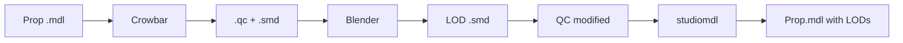

# Source Engine LOD Builder

<div align="center">


**Automatic LOD (Level of Detail) generator for Garry's Mod and Source Engine**

## [Version française de ce document (README_FR.md)](README_FR.md)

[Features](#-features) • [Installation](#-installation) • [Usage](#-usage) • [Configuration](#%EF%B8%8F-configuration) 

</div>

---

## Description

**Source Engine LOD Builder** is a professional tool that automates the creation of LOD (Level of Detail) models for Garry's Mod and Source Engine props. It parses your Hammer VMF map files or recursive model directories, automatically decompiles `.mdl` files, procedurally generates optimized low-poly versions using Blender, updates the QC configuration scripts, and recompiles them to drastically improve in-game performance.

### Why use LODs?

- **Increased Performance**: Greatly reduces polycounts for distant objects, relieving GPU overhead.
- **Substantial FPS Gains**: Provides an estimated 30% to 60% increase in FPS on dense and complex scenes.
- **Dynamic Distance**: Simplified models are loaded smoothly according to relative camera distance.
- **Preserved Visual Fidelity**: Seamless transitions with no noticeable aesthetic loss at normal gameplay distances.

---

## Features

### Discovery & Parsing

- **VMF File Parsing**: Scans Hammer map files (`.vmf`) to identify and count all referenced props.
- **Recursive Directory Scan**: Traverses local `models/` directories to search for `.mdl` assets.
- **Integrated VPK Extraction**: Automatically scans and extracts original models and material dependencies directly from Garry's Mod VPK archives.
- **Detailed Statistics**: Displays occurrence counts, prop classes (static, physics, dynamic), file sizes, and more.

### Optimized Generation

- **Automatic Pipeline**: End-to-end task chaining: Decompilation (via Crowbar) -> Decimation (via Blender) -> QC Adjustment -> Recompilation (via studiomdl).
- **Blender Integration**: Automates Blender via Python scripts to apply proportional decimation, preserving original visual silhouettes.
- **Adjustable LOD Levels**: Customizable generation of 1 to 8 distinct levels of detail.
- **Collision Mesh Management**: Options to either preserve the original collision geometry (`Keep`) or recreate simplified physics boundaries (`Rebuild`).
- **Multithreaded Execution**: Runs model decimation in parallel, making batch processing fast and efficient.

### Ergonomics & UI (New in v1.11)

- **Drag & Drop**: Drop VMF files directly onto the interface to start mapping and analyzing immediately.
- **Integrated 3D Preview**: Real-time interactive 3D viewer (OpenGL & Pyglet) to compare original models (LOD0) with simplified LODs side-by-side.
- **Precision Filtering**:
  - Filter by processing status (Ready, Processing, Done, Error).
  - Filter by prop class (prop_static, prop_physics, etc.).
  - Filter by minimum/maximum occurrences on the map.
  - **Filter by file size (KB/MB)** with precise range sliders.
- **Advanced Sorting**: Instant ascending or descending sorting by size or usage frequency to prioritize compiling heavier or more frequent models.
- **Bilingual Interface**: Seamless translation of the entire UI into French (FR) and English (EN).

### Diagnostics & Robustness

- **Status Correction (v1.11)**: Fixed a critical issue where models with compilation errors were incorrectly reset to "OK" status simply because temporary preview assets existed in the directories.
- **Profile Management**: Automatically saves and reloads your environment paths and generation settings, avoiding the need to re-configure on startup.
- **Detailed Logs**: Embedded console log showing each operation with timestamps for painless troubleshooting.

---

## Installation

The project now offers three simple installation methods tailored to your needs:

### 1. For End-Users: Pre-Compiled Release (Recommended)

This method requires absolutely no Python installation or manual package setup.

1. Download and extract the latest package from the **Releases** section of this repository.
2. Right-click on **`Install_Release.cmd`** and select **Run as Administrator**.
   - *This script will automatically:*
     - Check for Blender 4.x (and install it silently via winget if missing).
     - Download and configure the mandatory **SourceIO** Blender addon.
     - Scan Steam registries to automatically find your game installations.
     - Automatically download and place **`CrowbarCLI.exe`** into your `tools` folder if missing.
3. Launch the application via **`LOD_Generator.exe`**!

---

### 2. For Developers: Python Source Code

If you prefer to run the application from the raw Python scripts, first install the manual prerequisites or use the automated dev installer.

#### Manual Prerequisites
- **Python 3.8+**: [Download Python](https://www.python.org/downloads/)
- **Blender 4.x**: [Download Blender](https://www.blender.org/download/)
- **SourceIO Addon** (required for Blender): [Download SourceIO v5.5.3](https://github.com/REDxEYE/SourceIO/releases/download/5.5.3/SourceIO.zip)
  > SourceIO allows Blender to import Source Engine `.mdl` / `.smd` files.
- **studiomdl.exe**: Included with Source SDK or Garry's Mod (`GarrysMod/bin/studiomdl.exe`).

#### Automated Dev Environment Setup
We provide a PowerShell script to initialize your developer workspace:

1. Open a PowerShell terminal as Administrator at the root of the project.
2. Run the environment installer:
   ```powershell
   Set-ExecutionPolicy Bypass -Scope Process -Force
   .\Install_Dev.ps1
   ```
   - *This script sets up your Python modules, installs requirements (`pip install -r requirements.txt`), configures Blender with the SourceIO addon, and compiles an initial binary.*

#### Step-by-Step Manual Installation
1. Clone this repository:
   ```bash
   git clone https://github.com/Lumino-2-0/LOD-Generator-Source-SDK.git
   cd LOD-Generator-Source-SDK
   ```
2. Install the core required packages via pip:
   ```bash
   pip install -r requirements.txt
   ```
3. Install optional modules depending on your needs:
   - **For 3D Previewing**:
     ```bash
     pip install pyglet PyOpenGL
     ```
   - **For Drag & Drop support**:
     ```bash
     pip install tkinterdnd2
     ```
   - **For Image Previewing**:
     ```bash
     pip install Pillow
     ```
4. Launch the application from the command line:
   ```bash
   python LOD_Generator.py
   ```

---

### 3. Executable Compilation: Create the Standalone EXE

If you modify the source code and want to package your own standalone application:

1. Double-click the **`BuildEXE.cmd`** file.
   - *This script will install PyInstaller, discover the installation path for `tkinterdnd2`, bundle all required packages, embed CrowbarCLI and the custom app icon, and output a standalone `LOD_Generator.exe` in the `dist/` directory within 1-2 minutes.*

---

## Usage

### Quick Start

#### Option 1: Parse a VMF Map
1. Click the **"..."** button next to **VMF** and select your `.vmf` map file.
2. Click **Analyse VMF**.
3. All discovered map props will list alongside their usage count.

#### Option 2: Scan a Local Directory
1. Click the **"..."** button next to **Models folder** and select your directory containing `.mdl` files.
2. Click **Analyse Folder** to discover and list all models.

### Tool Path Configuration

Before generating LODs, configure your tool paths under the Tools tab:

- **Source/GMod**: Path to your main game folder containing `gameinfo.txt`.
- **Output**: Local directory where generated and recompiled models will be written.
- **studiomdl**: Absolute path to Valve's official model compiler (`studiomdl.exe`).
- **blender**: Path to your `blender.exe` executable.
- **Crowbar**: Path to `CrowbarCLI.exe` (defaults to `./tools/CrowbarCLI.exe`).

*Be sure to click **Save** to persist your setup.*

### Configuration & Generation

1. **Adjust compilation settings**:
   - **LOD Levels**: The amount of LOD steps to generate (from 1 to 8).
   - **Switch Distance**: The default threshold distance between each LOD step (e.g. 300 units).
   - **Physics Mode**:
     - `Keep` (Recommended): Re-uses the original collision model mesh.
     - `Rebuild`: Attempts to automatically compile a matching, simplified collision boundary.
2. **Select model assets** from the main registry list.
3. **Execute compilation**:
   - Click **SELECTED** to compile only highlighted props.
   - Click **ALL PROPS** to compile the entire list of discovered assets.

### Filtering & Sorting

- **Search**: Dynamic real-time filter by model name.
- **Status Filters**: All / Ready / Processing / Done / Error.
- **Class Filters**: Filter by prop classes (prop_static, prop_physics, etc.).
- **File Size Range**: Precise KB range sliders to isolate large models.
- **Dynamic Sorting**: Sort by "Size Desc" or "Count Desc" to prioritize heavier or more recurring props.

### Interactive 3D Preview
1. Select any prop from the main list.
2. Click **3D Preview**.
3. **Controls**:
   - Left-click + drag: Orbit the camera.
   - Scroll wheel: Zoom in/out.
   - Arrow keys: Rotate the model manually.
   - Slider: Cycle in real-time through the generated LOD levels.

---

## Advanced Configuration

### Settings File

The application properties are saved locally under the user's home profile at:
`%LOCALAPPDATA%/Temp/LodTEMP/settings.json`

Example file format:
```json
{
  "vmf_path": "C:/maps/mymap.vmf",
  "models_dir": "C:/garrysmod/models",
  "game_root": "C:/Program Files/Steam/steamapps/common/GarrysMod/garrysmod",
  "output_root": "C:/output",
  "studiomdl_path": "C:/garrysmod/bin/studiomdl.exe",
  "blender_path": "C:/Program Files/Blender Foundation/Blender 3.6/blender.exe",
  "crowbar_path": "C:/Tools/Crowbar/Crowbar.exe",
  "lod_levels": 3,
  "lod_distance": 300,
  "physics_mode": "keep",
  "max_workers": 7,
  "lang": "en"
}
```

### VPK Cache

The VPK extractor caches models in the following local directory:
`%LOCALAPPDATA%/Temp/LodTEMP/vpk_cache/`

- **Scan VPK**: Performed once to index the VPK archive structure and speed up future lookup queries.
- **Cache Folder Button**: Opens the local temporary workspace to clear cached models when needed.

### Multithreaded Execution

Batch jobs run on an adaptive thread scheduler (`concurrent.futures.ThreadPoolExecutor`):
- Auto-allocates workers (`CPU Count - 1`) to maximize processing speeds.
- Safe asynchronous queue allowing graceful cancel actions via the user interface at any time.
- Isolated exceptions handling per-thread so that a single corrupted asset compilation won't interrupt the rest of the batch queue.

---

## Technical Details & Pipeline

### Project Architecture

```
LOD_Generator.py
├── VPK Extraction System    -> Garry's Mod VPK archive reading & decompression
├── VMF Parser               -> Hammer map layout parser (.vmf)
├── Model Extraction         -> Recursive local asset scanner (.mdl)
├── QC Parser                -> Ast & syntactic modifier for QC configuration scripts
├── Blender Integration      -> Python engine for automated polygonal decimation and SMD exports
├── Crowbar Integration      -> Handles background decompilation procedures
├── studiomdl Integration    -> Direct compilation using official Valve compilers
├── 3D Preview System        -> Interactive real-time OpenGL/Pyglet rendering viewport
└── GUI (tkinter)            -> Responsive bilingual UI with drag-and-drop support
```

### Generation Pipeline

The generation process runs completely in the background:

```
[Original MDL Model]
        │
        ▼ (Automated Decompilation via CrowbarCLI)
[QC Scripts & Raw Geometry SMD files]
        │
        ▼ (Background Python scripts executed inside Blender)
[Generated Decimated LOD SMD Meshes]
        │
        ▼ (Text-manipulation injecting $lod blocks into the QC script)
[Updated QC Compilation Script]
        │
        ▼ (Recompilation via Valve's studiomdl compiler)
[Final Optimized MDL Asset with embedded LODs]
```

#### Pipeline flow represented as a flowchart:


### Supported Formats
- **Input**: Original `.mdl` models (Source Engine format).
- **Intermediates**: `.qc` scripts, `.smd` geometry meshes, `.vta` shape keys/morph sliders, and `.phy` collision bounds.
- **Output**: Recompiled `.mdl` assets packaged with embedded LOD data.

---

## AI-Assisted Development

This project makes extensive use of AI-assisted development, and that's entirely intentional.

AI allows me to prototype faster, solve complex technical problems, automate repetitive tasks and focus my time on designing better algorithms and improving the user experience.
Like any other development tool (compiler, debugger, IDE or version control), AI is a productivity tool—not a replacement for understanding the code. Every important feature is tested, adapted and integrated into the project to meet its specific goals.
I'm proud to use AI to build useful open-source tools more efficiently, while continuing to learn and improve my programming skills.

---

## Technical Limitations

- **Operating System**: The tool requires **Windows** due to its hard dependency on Valve's native compilers (`studiomdl.exe`) and `CrowbarCLI.exe`.
- **Hammer Layouts**: Only raw text `.vmf` files are supported (compiled `.bsp` formats cannot be read directly).
- **Complex Geometry**: Highly complex ragdoll physics or rigs containing multiple complex animation skeletal trees may experience decimation failures.

---

## Contributing

Contributions are always welcome!
1. Fork the project.
2. Create your feature branch (`git checkout -b feature/AmazingFeature`).
3. Commit your changes (`git commit -m 'Add some AmazingFeature'`).
4. Push to the branch (`git push origin feature/AmazingFeature`).
5. Open a Pull Request.

---

## License

This project is licensed under the MIT License. See the [LICENSE](LICENSE) file for more information.

---

## Acknowledgements

- **ZeqMacaw** for the incredible decompiler tool **Crowbar**.
- **UltraTechX** for the command-line interface **CrowbarCLI**.
- **REDxEYE** for the invaluable Blender **SourceIO** addon.
- **Blender Foundation** for providing an outstanding, world-class 3D creation suite.
- **Valve Corporation** for the Source Engine SDK utilities.

---

## Contact

- **Author**: Lumastor
- **GitHub**: [@Lumino-2-0](https://github.com/Lumino-2-0)
- **Discord**: [lumastor](https://discordapp.com/users/554200657486413824)

---

<div align="center">

**If this project saved you time, consider leaving a star on GitHub! ⭐**

</div>
