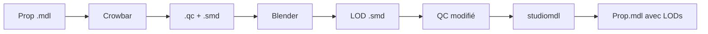

# Source Engine LOD Builder

<div align="center">


**Générateur automatique de LODs (Level of Detail) pour Garry's Mod et Source Engine**

## [English version of this document (README.md)](README.md)

[Fonctionnalités](#-fonctionnalités) • [Installation](#-installation) • [Utilisation](#-utilisation) • [Configuration](#%EF%B8%8F-configuration) 

</div>

---

## Description

**Source Engine LOD Builder** est un outil professionnel qui automatise la création de modèles LOD (Level of Detail) pour les props Garry's Mod et Source Engine. Il analyse vos maps VMF ou dossiers de modèles, décompile automatiquement les `.mdl`, génère des versions optimisées de manière procédurale avec Blender, met à jour les scripts QC de configuration, et les recompile pour améliorer drastiquement les performances in-game.

### Pourquoi utiliser des LODs ?

- **Performance accrue** : Réduction importante du nombre de polygones affichés pour les objets éloignés, allégeant la charge du GPU.
- **Gain de FPS substantiel** : Augmentation de 30% à 60% des FPS sur les scènes denses et complexes.
- **Distance dynamique** : Les modèles simplifiés sont chargés fluidement selon la distance relative de la caméra.
- **Fidélité visuelle préservée** : Aucune transition visible ni perte esthétique notable à distance de jeu normale.

---

## Fonctionnalités

### Analyse & Détection

- **Analyse de fichiers VMF** : Scanne vos fichiers de maps Hammer (`.vmf`) pour identifier et comptabiliser tous les props utilisés.
- **Analyse récursive de dossiers** : Parcourt vos dossiers locaux `models/` à la recherche de fichiers `.mdl`.
- **Extraction VPK intégrée** : Scanne et extrait automatiquement les modèles d'origine et leurs dépendances depuis les archives VPK de Garry's Mod.
- **Statistiques détaillées** : Nombre d'occurrences, classe de prop (static, physics, dynamic), taille des fichiers et plus.

### Génération Optimisée

- **Pipeline automatique** : Enchaînement complet des tâches : Décompilation (via Crowbar) -> Décimation (via Blender) -> Ajustement QC -> Recompilation (via studiomdl).
- **Intégration Blender** : Utilisation automatique de l'algorithme de décimation de Blender via scripts Python pour préserver la silhouette originale.
- **Niveaux de LOD ajustables** : Génération personnalisable de 1 à 8 niveaux de LOD distincts.
- **Gestion des Physiques** : Option pour conserver la géométrie de collision originale (`Keep`) ou la régénérer proportionnellement (`Rebuild`).
- **Exécution Multithread** : Traitement en parallèle des modèles pour un traitement par lots rapide et performant.

---

## Installation

Le projet propose désormais trois méthodes d'installation adaptées à vos besoins :

### 1. Méthode Utilisateur : Version Release (Recommandée)

Cette méthode ne nécessite aucune installation de Python ni de configuration manuelle.

1. Téléchargez et décompressez l'archive de la dernière version dans la section **Releases** du dépôt GitHub.
2. Faites un clic droit sur le fichier **`Install_Release.cmd`** et choisissez **Exécuter en tant qu'administrateur**.
   - *Ce script va automatiquement :*
     - Vérifier la présence de Blender 4.x (et proposer de l'installer silencieusement via winget si absent).
     - Télécharger et installer automatiquement l'addon **SourceIO** requis dans Blender.
     - Analyser les bibliothèques Steam pour localiser automatiquement vos dossiers de jeu.
     - Télécharger et placer le binaire **`CrowbarCLI.exe`** dans le dossier `tools` s'il est manquant.
3. Lancez l'application via **`LOD_Generator.exe`** !

---

### 2. Méthode Développeur : Code Source complet

Si vous souhaitez exécuter l'outil à partir des scripts Python d'origine, installez d'abord les prérequis manuels ou utilisez l'installateur de dev automatique.

#### Prérequis manuels
- **Python 3.8+** : [Télécharger Python](https://www.python.org/downloads/)
- **Blender 4.x** : [Télécharger Blender](https://www.blender.org/download/)
- **Addon SourceIO** (requis pour Blender) : [Télécharger SourceIO v5.5.3](https://github.com/REDxEYE/SourceIO/releases/download/5.5.3/SourceIO.zip)
  > SourceIO permet à Blender d'importer les fichiers `.mdl` / `.smd` Source Engine.
- **studiomdl.exe** : Inclus avec Source SDK ou Garry's Mod (`GarrysMod/bin/studiomdl.exe`).

#### Installation automatique de l'environnement de dev
Nous fournissons un script PowerShell d'initialisation complète :

1. Ouvrez un terminal PowerShell en administrateur à la racine du projet.
2. Exécutez le script d'installation :
   ```powershell
   Set-ExecutionPolicy Bypass -Scope Process -Force
   .\Install_Dev.ps1
   ```
   - *Ce script prépare votre environnement Python, installe les packages requis (`pip install -r requirements.txt`), configure Blender et l'addon SourceIO, et génère un premier exécutable.*

#### Installation manuelle étape par étape
1. Clonez ce repository :
   ```bash
   git clone https://github.com/Lumino-2-0/LOD-Generator-Source-SDK.git
   cd LOD-Generator-Source-SDK
   ```
2. Installez les packages requis via pip :
   ```bash
   pip install -r requirements.txt
   ```
3. Installez les modules optionnels selon vos besoins :
   - **Pour l'aperçu 3D** :
     ```bash
     pip install pyglet PyOpenGL
     ```
   - **Pour le support du glisser-déposer (Drag & Drop)** :
     ```bash
     pip install tkinterdnd2
     ```
   - **Pour l'aperçu d'images** :
     ```bash
     pip install Pillow
     ```
4. Lancez l'application en ligne de commande :
   ```bash
   python LOD_Generator.py
   ```

---

### 3. Méthode de Compilation : Créer l'exécutable (.exe)

Si vous modifiez le code source et souhaitez générer votre propre fichier exécutable autonome :

1. Lancez simplement le fichier **`BuildEXE.cmd`** (double-clic).
   - *Ce script va installer PyInstaller, détecter automatiquement l'emplacement d'installation du module tkinterdnd2, packager toutes les dépendances requises, intégrer CrowbarCLI et l'icône de l'application, et compiler le tout en un fichier unique `LOD_Generator.exe` dans le répertoire `dist/` en 1 à 2 minutes.*

---

## Utilisation

### Démarrage Rapide

#### Option 1 : Analyser une Map VMF
1. Cliquez sur le bouton **"..."** à côté de **VMF** et sélectionnez votre fichier `.vmf`.
2. Cliquez sur **Analyse VMF**.
3. Les props détectés s'affichent avec leur nombre d'occurrences.

#### Option 2 : Analyser un Dossier de Modèles
1. Cliquez sur le bouton **"..."** à côté de **Models folder** et sélectionnez un répertoire contenant des fichiers `.mdl`.
2. Cliquez sur **Analyse Folder** pour lister tous les modèles découverts.

### Configuration des Outils

Avant de générer les LODs, configurez les chemins d'accès obligatoires dans l'onglet des outils :

- **Source/GMod** : Le chemin vers votre dossier de jeu principal (contenant le fichier `gameinfo.txt`).
- **Output** : Dossier local où seront écrits vos modèles simplifiés recompilés.
- **studiomdl** : Chemin complet vers le compilateur officiel de Valve (`studiomdl.exe`).
- **blender** : Chemin vers votre binaire `blender.exe`.
- **Crowbar** : Chemin vers `CrowbarCLI.exe` (situé par défaut dans `./tools/CrowbarCLI.exe`).

*Pensez à cliquer sur **Save** pour conserver vos réglages.*

### Paramètres et Génération

1. **Réglez les options de génération** :
   - **LOD Levels** : Nombre de paliers à générer (de 1 à 8).
   - **Switch Distance** : La distance de transition par défaut entre chaque palier (ex: 300 unités).
   - **Physics Mode** :
     - `Keep` (Recommandé) : Conserve le modèle de collision d'origine.
     - `Rebuild` : Tente de régénérer un modèle de collision proportionnel de manière simplifiée.
2. **Sélectionnez vos props** dans la liste principale.
3. **Lancez la génération** :
   - Cliquez sur **SELECTED** pour traiter uniquement les props sélectionnés.
   - Cliquez sur **ALL PROPS** pour traiter l'intégralité de la liste.

### Filtrage et Tri

- **Recherche** : Filtrage dynamique par nom de modèle en temps réel.
- **Filtres de statut** : All / Ready / Processing / Done / Error.
- **Filtre de classe** : Filtrage par classe (prop_static, prop_physics, etc.).
- **Taille de fichier** : Filtrage précis en kilo-octets (Ko) pour isoler les props volumineux.
- **Tri dynamique** : Triez par "Size Desc" ou "Count Desc" pour prioriser les modèles les plus lourds ou les plus fréquents.

### Aperçu 3D interactif
1. Sélectionnez un prop dans la liste principale.
2. Cliquez sur **3D Preview**.
3. **Contrôles** :
   - Clic gauche + glisser : Pivoter la caméra.
   - Molette de la souris : Zoomer.
   - Touches directionnelles : Pivoter le modèle au clavier.
   - Curseur : Naviguer en temps réel entre les différents niveaux de LOD générés.

---

## Configuration Avancée

### Fichier de Configuration

Les paramètres de l'application sont sauvegardés localement dans le profil utilisateur sous :
`%LOCALAPPDATA%/Temp/LodTEMP/settings.json`

Exemple de structure de fichier :
```json
{
  "vmf_path": "C:/maps/mymap.vmf",
  "models_dir": "C:/garrysmod/models",
  "game_root": "C:/Program Files/Steam/steamapps/common/GarrysMod/garrysmod",
  "output_root": "C:/output",
  "studiomdl_path": "C:/garrysmod/bin/studiomdl.exe",
  "blender_path": "C:/Program Files/Blender Foundation/Blender 3.6/blender.exe",
  "crowbar_path": "C:/Tools/Crowbar/Crowbar.exe",
  "lod_levels": 3,
  "lod_distance": 300,
  "physics_mode": "keep",
  "max_workers": 7,
  "lang": "en"
}
```

### Cache VPK

L'extracteur VPK met en cache les modèles dans :
`%LOCALAPPDATA%/Temp/LodTEMP/vpk_cache/`

- **Scan VPK** : Réalisé une seule fois pour indexer l'archive et accélérer les requêtes futures.
- **Bouton Cache** : Permet d'ouvrir et vider directement le cache de l'application si nécessaire.

### Exécution Multithread

Le traitement par lots s'appuie sur un exécuteur de threads adaptatif (`concurrent.futures.ThreadPoolExecutor`) :
- Allocation automatique de threads (`CPU Count - 1`) pour maximiser la vitesse.
- File d'attente asynchrone sécurisée avec possibilité d'arrêt d'urgence propre à tout moment via l'interface.
- Gestion isolée des exceptions par thread pour qu'une erreur sur un modèle ne bloque pas le reste du traitement.

---

## Détails Techniques & Pipeline

### Architecture du Projet

```
LOD_Generator.py
├── VPK Extraction System    -> Gestion et décompression des archives VPK de Garry's Mod
├── VMF Parser               -> Analyseur syntaxique de maps Hammer (.vmf)
├── Model Extraction         -> Scanner récursif de modèles locaux (.mdl)
├── QC Parser                -> Analyse et réécriture des fichiers de configuration QC
├── Blender Integration      -> Automatisation de la décimation polygonale et export SMD
├── Crowbar Integration      -> Gestion des tâches de décompilation en arrière-plan
├── studiomdl Integration    -> Compilation native via le binaire officiel de Valve
├── 3D Preview System        -> Moteur de rendu interactive temps réel OpenGL/Pyglet
└── GUI (tkinter)            -> Interface utilisateur graphique bilingue avec Drag & Drop
```

### Pipeline de Génération

Le traitement se déroule entièrement de manière transparente :

```
[Modèle MDL Original]
        │
        ▼ (Décompilation automatique via CrowbarCLI)
[Fichiers QC + Géométrie brute SMD]
        │
        ▼ (Script Python exécuté en arrière-plan par Blender)
[Génération des fichiers SMD simplifiés des LODs]
        │
        ▼ (Écriture et injection des blocs $lod dans le script QC)
[Script de compilation QC mis à jour]
        │
        ▼ (Recompilation via le compilateur studiomdl)
[Modèle MDL final optimisé avec LODs intégrés]
```

#### Modélisation du pipeline en graphe de flux :


### Formats Supportés
- **Entrée** : Fichiers `.mdl` d'origine (Source Engine).
- **Intermédiaires** : Scripts `.qc`, maillages géométriques `.smd`, fichiers de morphing de formes `.vta`, et enveloppes de collision `.phy`.
- **Sortie** : Fichiers recompilés `.mdl` enrichis de leurs structures de LODs intégrées.

---

## AI-Assisted Development

Ce projet fait appel au développement assisté par l'IA, et ce, de manière tout à fait intentionnelle.

L'IA me permet de prototyper plus rapidement, de résoudre des problèmes techniques complexes, d'automatiser les tâches répétitives et de consacrer mon temps à la conception d'algorithmes plus performants et à l'amélioration de l'expérience utilisateur.
Comme tout autre outil de développement (compilateur, débogueur, IDE ou système de gestion de versions), l'IA est un outil de productivité, et non un substitut à la compréhension du code. Chaque fonctionnalité importante est testée, adaptée et intégrée au projet afin de répondre à ses objectifs spécifiques.
Je suis fier d'utiliser l'IA pour développer plus efficacement des outils open source utiles, tout en continuant à apprendre et à perfectionner mes compétences en programmation.

---

## Limitations Techniques

- **Système d'exploitation** : L'outil requiert un système **Windows** en raison de sa dépendance directe envers les utilitaires natifs du SDK de Valve (`studiomdl.exe`) et `CrowbarCLI.exe`.
- **Fichiers VMF** : Seuls les fichiers VMF au format texte d'origine créés par l'éditeur Hammer sont pris en charge (les versions compilées `.bsp` ne sont pas lisibles).
- **Modèles complexes** : Les modèles de physiques très complexes (ragdolls articulés) ou contenant de multiples animations peuvent nécessiter un ajustement ou rencontrer des erreurs de décimation ou de recompilation à cause du qc parfois adapté.

---

## Contribution

Les contributions au projet sont les bienvenues !
1. Forkez le projet.
2. Créez votre branche de fonctionnalité (`git checkout -b feature/AmazingFeature`).
3. Enregistrez vos modifications (`git commit -m 'Add some AmazingFeature'`).
4. Poussez sur la branche (`git push origin feature/AmazingFeature`).
5. Ouvrez une Pull Request.

---

## License

Ce projet est disponible sous licence MIT. Voir le fichier [LICENSE](LICENSE) pour plus d'informations.

---

## Remerciements

- **ZeqMacaw** pour le formidable décompilateur **Crowbar**.
- **UltraTechX** pour le port en ligne de commande **CrowbarCLI**.
- **REDxEYE** pour l'excellent addon **SourceIO** pour Blender.
- **Blender Foundation** pour leur suite de modélisation 3D open-source d'exception.
- **Valve Corporation** pour le Source Engine et les outils SDK officiels.
- **Garry et Rubat** pour avoir crée et pour maintenir **GMod**.

---

## Contact

- **Auteur** : Lumastor
- **GitHub** : [@Lumino-2-0](https://github.com/Lumino-2-0)
- **Discord** : [lumastor](https://discordapp.com/users/554200657486413824)

---

<div align="center">

**Si ce projet vous est utile, n'hésitez pas à lui laisser une étoile sur GitHub ! ⭐**

</div>
